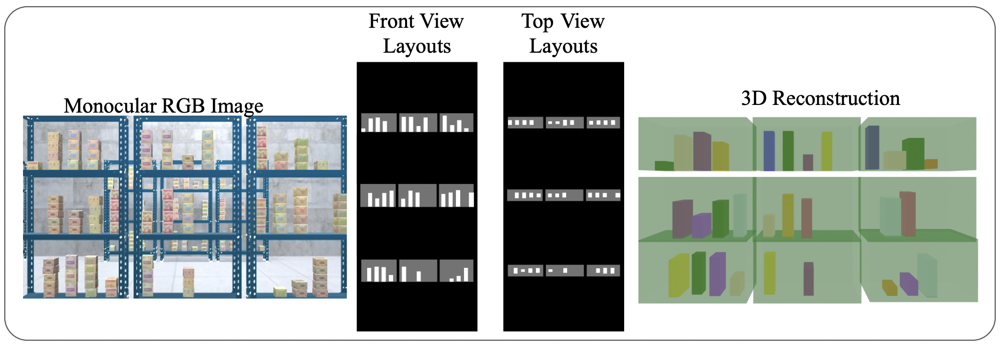

# MVRackLay: Monocular Multi-View Layout Estimation for Warehouse Rack and Shelves


#### [Pranjali Pathre](https://github.com/pranjali-pathre/), [Anurag Sahu](https://anuragsahu.github.io/), Ashwin Rao, [Avinash Prabhu](https://avinash2468.github.io/), [Meher Shashwat Nigam](https://github.com/ShashwatNigam99), [Tanvi Karandikar](https://tanvi141.github.io/), Harit Pandya, and [K. Madhava Krishna](http://robotics.iiit.ac.in)

<!-- ####  [Video]( https://youtu.be/1hdl3W-MlXo) -->
<!-- [Paper](https://arxiv.org/abs/2002.08394) -->
<!-- #### Accepted to [WACV 2020](http://wacv20.wacv.net/) -->

<p align="center">
    
</p>

## Repository Structure

```
├── data # Store the *MVRackLay* data or custom data using *WareSynth* here.
├── racklay
│   ├── dataloader.py # Reading the data from the dataset and preparing it for training
│   ├── datasets.py
│   ├── __init__.py
│   ├── model.py
│   └── resnet_encoder.py 
│   ├── convlstm.py
│   ├── videolayout.py
├── splits
│   └── warehouse
│       ├── train_temporal_files.txt # Indices to files from the dataset used for training
│       └── val_temporal_files.txt # Indices to files from the dataset used for validation
├── eval_vracklay.py # Get metrics (mIOU and mAP) 
├── train.py
└── utils.py 
```


## Installation

We recommend setting up a Python 3.7 Virtual Environment and installing all the dependencies listed in the requirements file. 

```
git clone https: https://github.com/pranjali-pathre/MVRackLay

cd MVRackLay
pip install -r requirements.txt
```

## Download *RackLay* Dataset

https://tinyurl.com/yxmu5t64

## Training

Example code for training Racklay is provided below.

```
python train.py 
--model_name videolayout 
--seq_len 4 --type both 
--batch_size 2 
--num_epochs 73 
--split warehouse 
--data_path ./data/afinalData/ 
--num_racks 3 
--log_frequency 3 
--occ_map_size 512

```

## Evaluation

For evaluating a trained model use `eval.py` by specifying the mode used for training, the data split on which to evaluate as well as the path to the trained model directory. 

```
python eval_vracklay.py  
--pretrained_path ./models/videolayout/warehouse/weights_72/ 
--split warehouse 
--seq_len 4 
--type <both/topview/frontview>
--num_racks 3 
--occ_map_size 512

```
