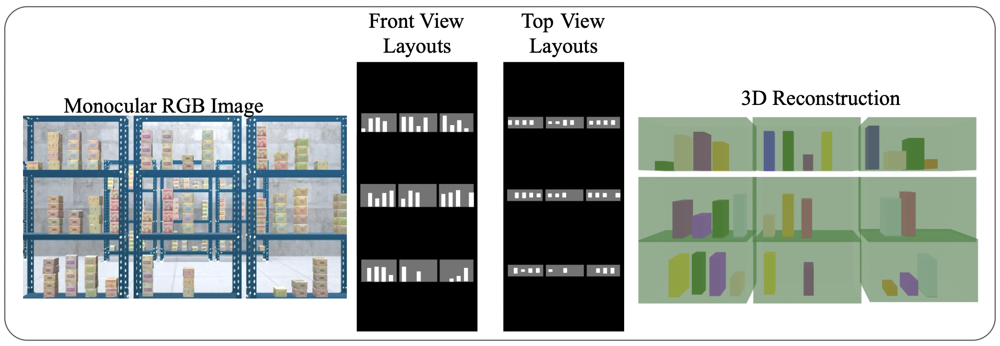
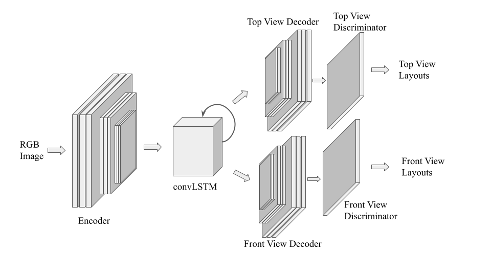
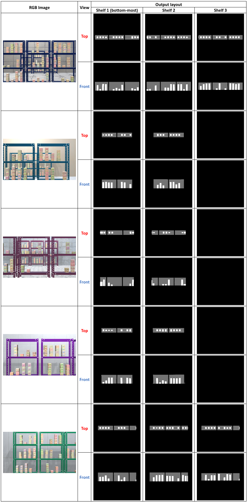
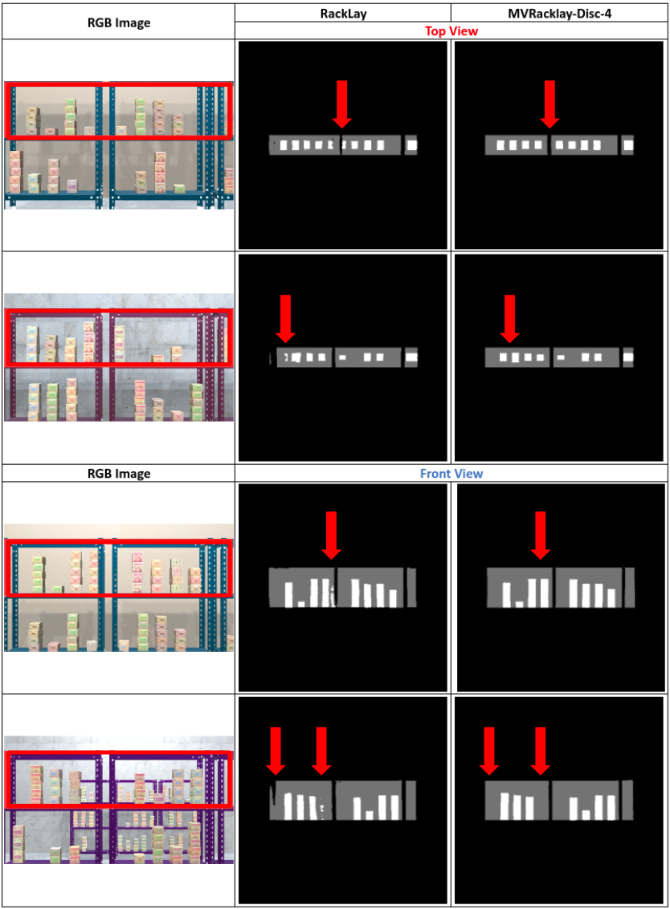
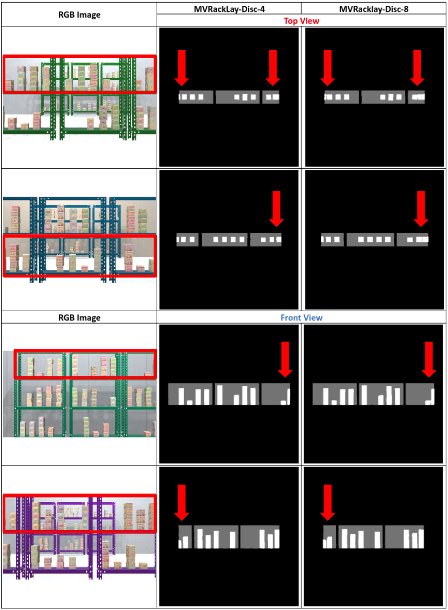

# MVRackLay: Monocular Multi-View Layout Estimation for Warehouse Rack and Shelves

[Pranjali Pathre](https://github.com/pranjali-pathre/), [Anurag Sahu](https://anuragsahu.github.io/), Ashwin Rao, [Avinash Prabhu](https://avinash2468.github.io/), [Meher Shashwat Nigam](https://github.com/ShashwatNigam99), [Tanvi Karandikar](https://tanvi141.github.io/), Harit Pandya, and [K. Madhava Krishna](http://robotics.iiit.ac.in)

    

## Code
Link to code: https://github.com/pranjali-pathre/MVRackLay 

Link to download Dataset: https://tinyurl.com/yxmu5t64

## Dataset Generation Pipeline
[Waresynth](https://github.com/Tanvi141/WareSynthUnity)

## Architecture

    

Architecture comprises of a context encoder, a Convolutional LSTM for encoding temporal information and multi-channel decoders and adversarial discriminators.

## Results
### MVRackLay-Disc-4 Results
Here, we present the results of our network tested on domain randomized data. The bottommost shelf layout is shown in the left-most column, followed by the middle and top shelf (if visible). Observe the diversity of warehouse scenes captured and the top-view and front-view layouts predicted for the same.

    

### RackLay vs. MVRackLay-Disc-4
Above, we compare qualitatively the results of RackLay and our MVRackLay-Disc-4. The shelf in focus is highlighted with a red border. Observe that our model removes the false positive and noise in row 1, fixes the false negative in row 2, removes noise in row 3 and 4, and increases sharpness of both box boundaries (all rows) and shelf edges.

    

### MVRackLay-Disc-4 vs. MVRackLay-Disc-8 
The shelf in focus is highlighted with a red border. Better demarcations between adjoining boxes and less joining of abreast layouts are observed in the output of MVRackLay-Disc-4 compared to its counterpart.

    

## Contact information
- pranjali2000pathre@gmail.com
