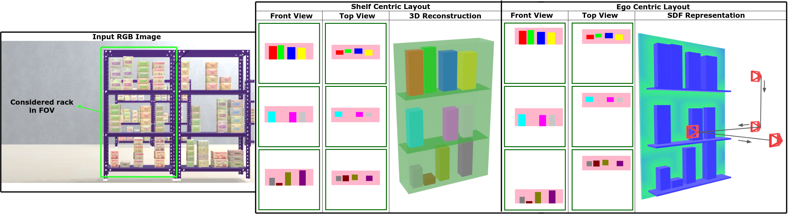

# MVRackLay: Monocular Multi-View Layout Estimation for Warehouse Rack and Shelves

#### [Pranjali Pathre](https://github.com/pranjali-pathre/), [Anurag Sahu](https://anuragsahu.github.io/), Ashwin Rao, Harit Pandya, and [K. Madhava Krishna](http://robotics.iiit.ac.in)

<!-- ####  [Video]( https://youtu.be/1hdl3W-MlXo) -->
<!-- [Paper](https://arxiv.org/abs/2002.08394) -->
<!-- #### Accepted to [WACV 2020](http://wacv20.wacv.net/) -->

    

